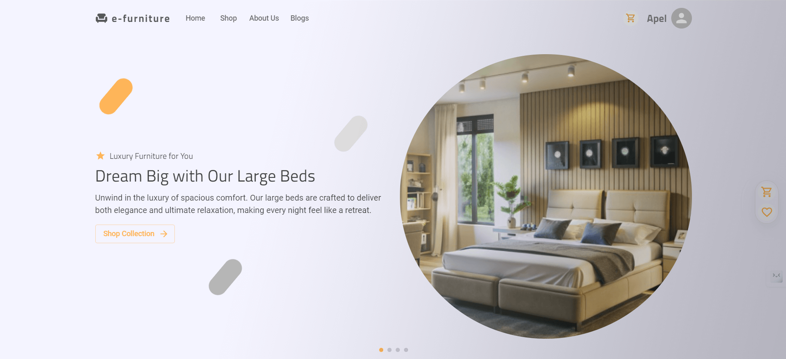

# e-furniture: Your One-Stop Online Furniture Shop




Welcome to **e-furniture**, the premier e-commerce platform for stylish and affordable furniture! Our mission is to provide customers with high-quality, unique furniture pieces that transform their living spaces without breaking the bank.

## Features

- **User-Friendly Interface**: Intuitive design for easy navigation and seamless shopping experience.
- **Wide Selection**: Explore a diverse range of furniture styles, from modern to classic.
- **Secure Checkout**: Enjoy a safe shopping experience with secure payment options.
- **Responsive Design**: Optimized for all devices—shop on your phone, tablet, or desktop.
- **Sustainable Choices**: Discover eco-friendly furniture options crafted with sustainability in mind.

### Comprehensive Functionality

- **Add to Cart** functionality
- **Add to Favorites/Wishlist**
- **Quick View** for products
- **View Store/View All** options
- **Interior Ideas** blog section
- Background **Parallax Scrolling** image
- Dynamic title change with page change using **React Helmet**
- Comprehensive **About** page
- Engaging **Footer**
- **Loading Skeleton/Loading Sign** for better UX
- Related **Favicon**
- **Code Splitting** with React Lazy
- **React Idle Timer** to handle idle users and redirects
- User and admin handling
- **Dashboard** for admin
- Use **localStorage** to save user cash data

### 🔐 Admin Accessibility

Admin can access all services as usual.

**Credentials**:  
 email: super.admin@gmail.com
password: @super123

**Admin Dashboard Links**:

- `/admin/dashboard`
- `/admin/orders`
- `/admin/products`

## Technologies Used

- **Frontend**: React.js, TypeScript, Redux Toolkit, RTK Query, MUI (Material UI) for building UI
- **Backend**: Node.js, Express.js
- **Database**: MongoDB, Mongoose
- **Deployment**: Netlify for frontend, vercel for backend

## Installation

To get started with e-furniture locally, follow these steps:

1. **Clone the repository:**

   ```bash
   git clone https://github.com/apelmahmudDev/e-furniture.git
   cd sale-point
   ```

2. **Install dependencies:**

   ```bash
   yarn install
   ```

3. **Run the development server:**

   ```bash
   yarn start
   ```

4. **Open the application:**

   Open [http://localhost:3000](http://localhost:3000) to view it in the browser.

### Backend Repository

For the backend implementation, visit: [e-furniture-server](https://github.com/apelmahmudDev/e-furniture-server)

### Contact

For any inquiries, feel free to reach out:

Email: apelmahmud.dev@gmail.com
LinkedIn: [Apel Mahmud](https://www.linkedin.com/in/apelmahmuddev/)
